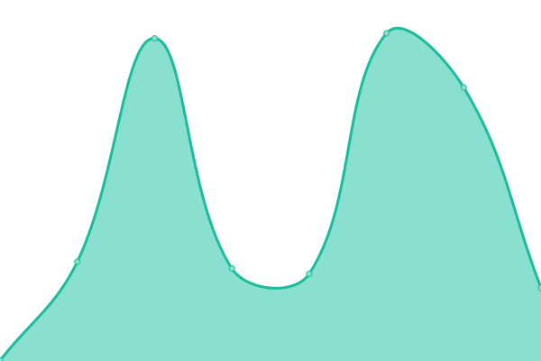
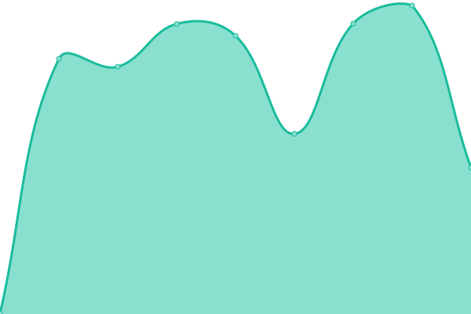

# [📈 Live Status](https://nachosalvi.github.io/upptime): <!--live status--> **🟧 Partial outage**

This repository contains the open-source uptime monitor and status page for [Dario Salvi](https://nachosalvi.github.io/upptime), powered by [Upptime](https://github.com/upptime/upptime).

With [Upptime](https://upptime.js.org), you can get your own unlimited and free uptime monitor and status page, powered entirely by a GitHub repository. We use [Issues](https://github.com/nachosalvi/upptime/issues) as incident reports, [Actions](https://github.com/nachosalvi/upptime/actions) as uptime monitors, and [Pages](https://nachosalvi.github.io/upptime) for the status page.

<!--start: status pages-->
<!-- This summary is generated by Upptime (https://github.com/upptime/upptime) -->
<!-- Do not edit this manually, your changes will be overwritten -->
<!-- prettier-ignore -->
| URL | Status | History | Response Time | Uptime |
| --- | ------ | ------- | ------------- | ------ |
|  [Aysa Sitio Corporativo](https://www.aysa.com.ar) | 🟥 Down | [aysa-sitio-corporativo.yml](https://github.com/nachosalvi/upptime/commits/HEAD/history/aysa-sitio-corporativo.yml) | 

 0ms
     
 | 

<a href="https://nachosalvi.github.io/upptime/history/aysa-sitio-corporativo">0.00%</a>
    

|  [Aysa Intranet](https://intranet.aysa.com.ar/login) | 🟥 Down | [aysa-intranet.yml](https://github.com/nachosalvi/upptime/commits/HEAD/history/aysa-intranet.yml) | 

 0ms
     
 | 

<a href="https://nachosalvi.github.io/upptime/history/aysa-intranet">0.00%</a>
    

|  [Aysa ServiceDesk](https://servicedesk.aysa.com.ar) | 🟩 Up | [aysa-service-desk.yml](https://github.com/nachosalvi/upptime/commits/HEAD/history/aysa-service-desk.yml) | 

 429ms
     
 | 

<a href="https://nachosalvi.github.io/upptime/history/aysa-service-desk">100.00%</a>
    

|  [Aysa Oficina Virtual](https://oficinavirtual.web.aysa.com.ar/index.html) | 🟩 Up | [aysa-oficina-virtual.yml](https://github.com/nachosalvi/upptime/commits/HEAD/history/aysa-oficina-virtual.yml) | 

 801ms
     
 | 

<a href="https://nachosalvi.github.io/upptime/history/aysa-oficina-virtual">100.00%</a>
    

|  [Aysa Mail](https://mail.aysa.com.ar) | 🟥 Down | [aysa-mail.yml](https://github.com/nachosalvi/upptime/commits/HEAD/history/aysa-mail.yml) | 

 1957ms
     
 | 

<a href="https://nachosalvi.github.io/upptime/history/aysa-mail">48.13%</a>
    

<!--end: status pages-->

[**Visit our status website →**](https://nachosalvi.github.io/upptime)

## 📄 License

- Powered by: [Upptime](https://github.com/upptime/upptime)
- Code: [MIT](./LICENSE) © [Dario Salvi](https://nachosalvi.github.io/upptime)
- Data in the `./history` directory: [Open Database License](https://opendatacommons.org/licenses/odbl/1-0/)
